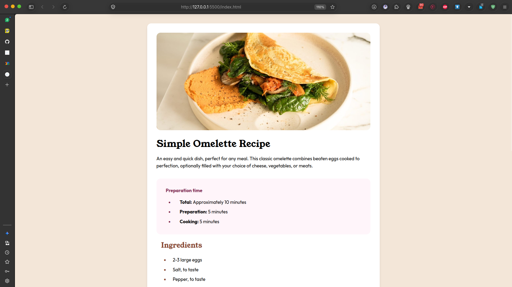

# Frontend Mentor - Recipe page solution

This is a solution to the [Recipe page challenge on Frontend Mentor](https://www.frontendmentor.io/challenges/recipe-page-KiTsR8QQKm). Frontend Mentor challenges help you improve your coding skills by building realistic projects. 

## Table of contents

- [Overview](#overview)
  - [The challenge](#the-challenge)
  - [Screenshot](#screenshot)
  - [Links](#links)
- [My process](#my-process)
  - [Built with](#built-with)
  - [What I learned](#what-i-learned)
  - [Continued development](#continued-development)
  - [Useful resources](#useful-resources)
  - [AI Collaboration](#ai-collaboration)
- [Author](#author)

**Note: Delete this note and update the table of contents based on what sections you keep.**

## Overview

This project is my solution to the Frontend Mentor Recipe page challenge. I built a responsive recipe page for a simple omelette recipe using HTML and CSS.

### Screenshot



### Links

- Solution URL: [This Repo]
- Live Site URL: [Here](https://cliff-de-tech.github.io/recipe-page-main/)

## My process

### Built with

- Semantic HTML5 markup
- CSS custom properties
- Flexbox
- Responsive CSS
- Google Fonts
- Accessible HTML lists and tables


### What I learned

I practised structuring content with semantic HTML elements, including sections, headings, lists, and tables. I also learned how to use CSS custom properties, style list markers, create table borders, and adjust the layout for different screen sizes.

I  also learned how CSS pseudo-classes can target specific elements. For example, :not(:last-child) allowed me to add borders to every nutrition table row except the final row, creating the correct number of horizontal divider lines.

```css
#ingredients-table tr:not(:last-child) th,
#ingredients-table tr:not(:last-child) td {
  border-bottom: 1px solid var(--color-stone-150)
}
```

### Continued development

I would like to continue improving my responsive design skills and become more comfortable matching spacing, typography, and layout details from a design reference.

### Useful resources

- [MDN CSS Reference](https://developer.mozilla.org/en-US/docs/Web/CSS) - This helped me to understand CSS properties and selectors.
- [Frontend Mentor](https://www.frontendmentor.io/) - Provided the challenge design and project requirements.

### AI Collaboration

I used GitHub Copilot as a learning assistant. It helped me understand semantic HTML, CSS selectors, list markers, table borders, and responsive media queries. I wrote and tested the code myself while using the explanations to solve problems.

## Author

- Website - [My website](https://cliffdetech.dev)
- Frontend Mentor - [@yourusername](https://www.frontendmentor.io/profile/cliff-de-tech)
- Twitter - [@yourusername](https://www.twitter.com/cliffdetech)
